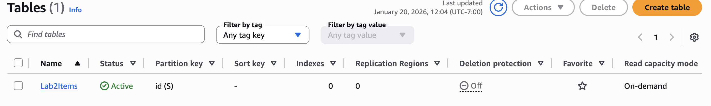
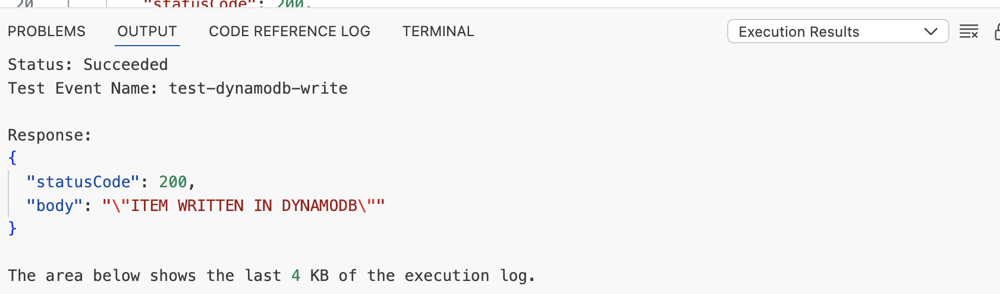
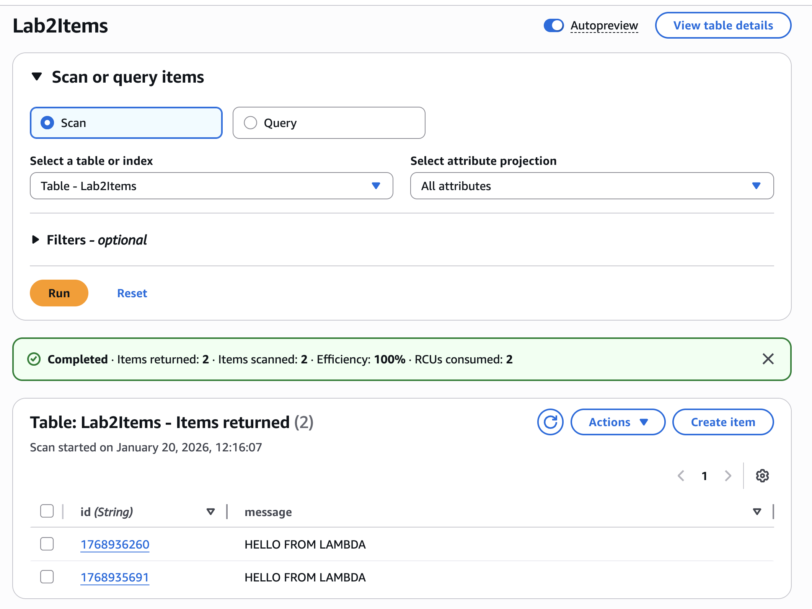

# AWS Lab 2 – Lambda Writing to DynamoDB

## What this does

An AWS Lambda function writes data to a DynamoDB table using serverless architecture.

## Architecture

Lambda → DynamoDB → CloudWatch

## Technologies Used

- AWS Lambda
- Amazon DynamoDB
- IAM
- Python
- CloudWatch

## What this proves

- Serverless backend development
- NoSQL database integration
- IAM permissions management
- Real-world cloud data flow

## Screenshots (Proof of Work)

### 1. DynamoDB Table Created

### 2. Lambda Function Created

### 3. IAM Permissions

### 4. Lambda Test Execution

### 5. Data Written to DynamoDB

