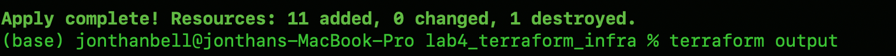
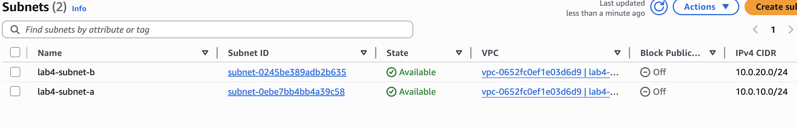
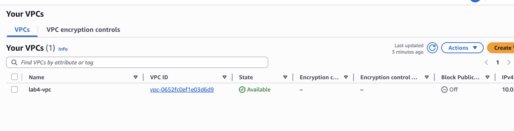
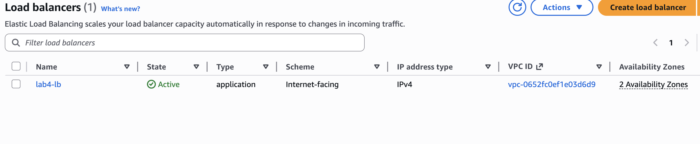
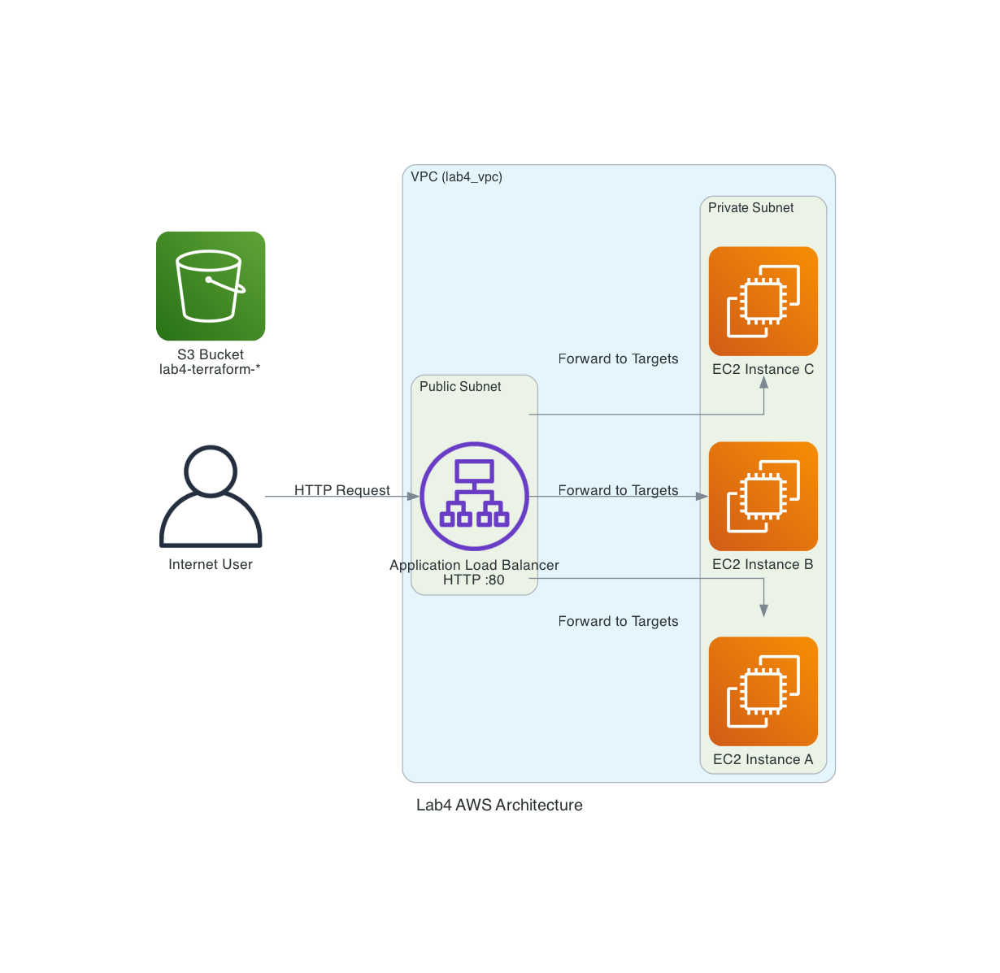

# AWS Lab 4 — Terraform 3-Tier Web Architecture with ALB

## What this does

This lab provisions a **complete AWS web architecture using Terraform**.

Instead of manually building resources in the AWS Console, all infrastructure is defined as code and deployed automatically.

A public Application Load Balancer distributes traffic across multiple EC2 web servers running Apache.

---

## Architecture

Internet → Application Load Balancer → EC2 Instances → VPC Network

Terraform creates:

- Custom VPC
- Public subnets in **two Availability Zones**
- Internet Gateway
- Route Table
- Application Load Balancer
- Target Group + Listener
- 3 EC2 Web Servers
- Security Groups
- S3 Bucket (for Terraform practice)

---

## Technologies Used

- Terraform
- AWS EC2
- AWS VPC
- AWS Subnets
- AWS Internet Gateway
- AWS Route Tables
- AWS Security Groups
- AWS Application Load Balancer (ALB)
- AWS Target Groups
- Amazon Linux 2
- Apache Web Server

---

## What this proves

- Infrastructure as Code (IaC) skills
- Ability to design cloud network architecture
- Load balancing & high availability
- Security group design (ALB → EC2 traffic control)
- Multi-AZ deployment
- Automated server provisioning with user_data scripts

This lab demonstrates real-world cloud engineering practices.

---

## Screenshots (Proof of Work)

### 1. Terraform Apply Successful



### 2. EC2 Instances Running


### 3. Subnets created



### 4. VPC created



### 5. Load Balancer DNS Working in Browser



### 6. Browser page working


---

## How to Deploy

```bash
terraform init
terraform plan
terraform apply
```

After deployment, Terraform outputs the Load Balancer DNS name:

```
http://<load-balancer-dns>
```

Open in browser to see:

```
Hello from Terraform EC2 instance
```

---

## Key Learning Moment

This lab required troubleshooting:

- Security Group dependency issues
- Subnet design across AZs
- Load Balancer requirements
- Terraform resource references

These are common real-world cloud engineering challenges.

---

## Next Step

Add architecture diagram here:



## Diagram as Code

The architecture diagram was generated programmatically using Python's Diagrams library.
